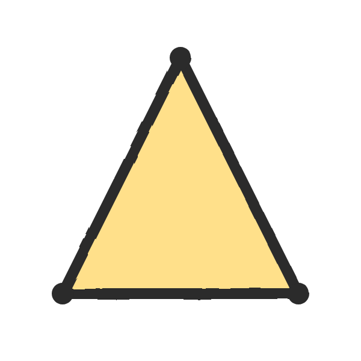
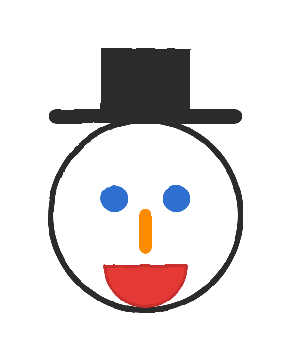
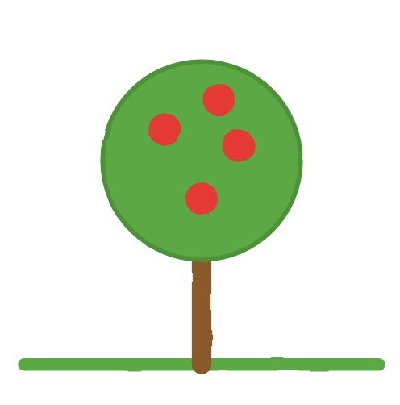
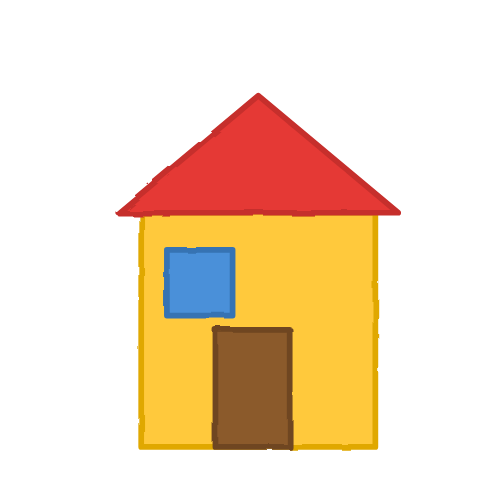
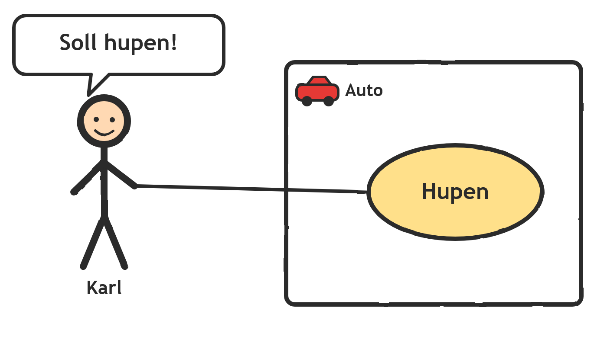
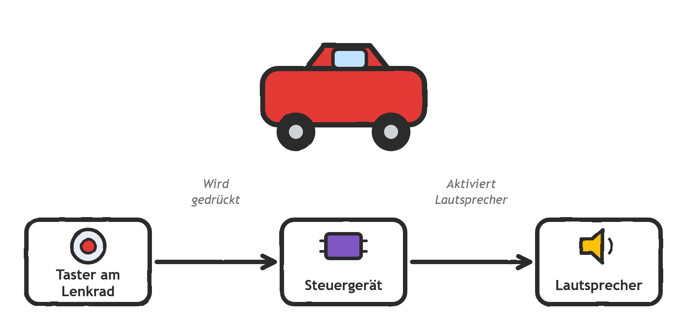
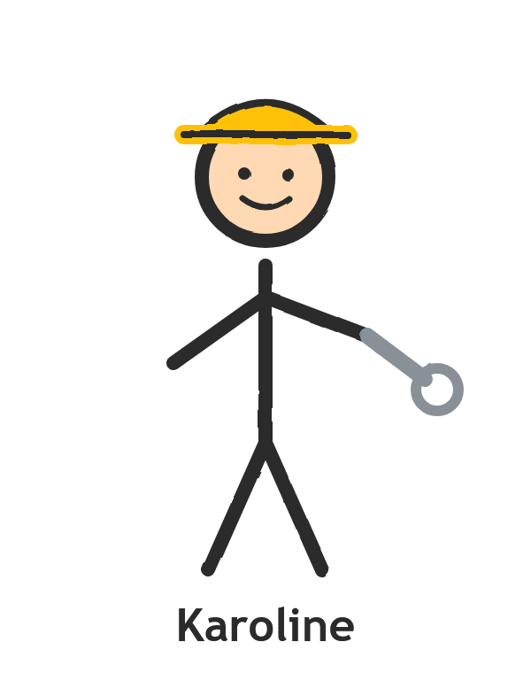
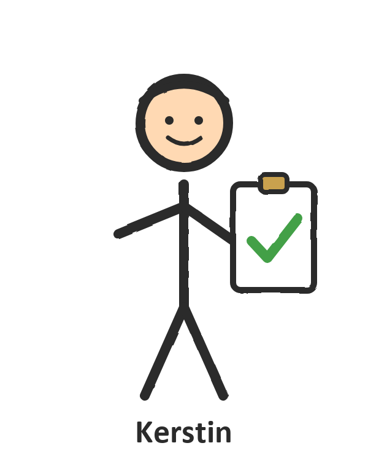
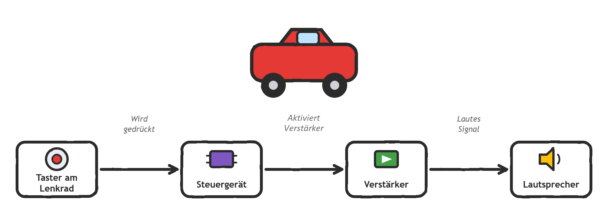
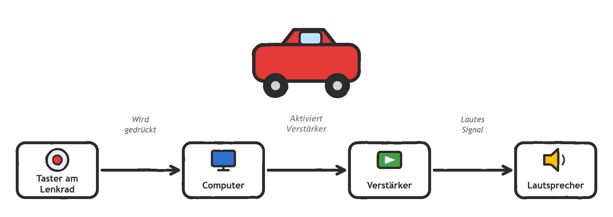

# Beruf „Systems Engineer"

## Erklärt für Kinder in einer Volksschulen-Mehrstufenklasse

*Zielgruppe: Kinder einer Mehrstufenklasse (1.-4. Klasse) in einer Wiener Volksschule. Alter: 6-11 Jahre.*

## Prolog

Ich bin ein „Systems Engineer". Das ist jemand, der komplexe Dinge beschreibt, so dass man sie dann bauen kann. Konkret beschäftige ich mich mit Autos. Autos müssen viele Dinge können – z.B. fahren, lenken, bremsen – und bestehen aus vielen Teilen: Räder, Dach, Türe, Lenkrad und ganz viele Computer (ca. 80 Stück).

> **Frage:** Was muss ein Auto alles können?

> **Frage:** Was wäre cool, wenn ein Auto das auch noch könnte?

Unsere Kunden sind Autohersteller (z.B. Ferrari) und die sagen uns, was ihre Autos Besonderes können sollen. Das Schwierige ist, die Kundenwünsche richtig zu verstehen und sie dann so zu beschreiben, dass wir das dann auch bauen können.

Meine Aufgabe ist zu beschreiben, welche Teile wie funktionieren müssen, damit das Auto z.B. bremst, wenn man auf das Bremspedal drückt. Diese Beschreibung mache ich nicht alleine, sondern zusammen mit 200-300 Kolleginnen.

## Werkzeug

Wie machen wir das? Indem wir aufschreiben, was das Auto können soll. Dann überlegen wir uns, welche Teile dafür benötigt werden, und schreiben auf, wie die Teile funktionieren müssen, damit das Auto das kann. Das nennen wir „Anforderungen" – also das, was wir sagen, dass ein Ding können muss.

Anforderungen an ein Dreieck:

- Ein Dreieck muss drei Ecken haben.
- Jede Ecke muss mit den beiden anderen Ecken mit einer geraden Linie verbunden sein.

## Gruppenaufgabe 1

*Aufteilung der Klasse in 4 Gruppen – in jeder Gruppe muss mindestens ein Kind der 3. oder 4. Klasse sein. Am besten von jeder Schulstufe mindestens ein Kind. Jedes Kind braucht ein Blatt Papier und Buntstifte.*

Ihr bekommt jetzt Anforderungen an eine Zeichnung, die ihr in der Gruppe zeichnen sollt. Ihr habt 5 Minuten Zeit.

1. In der Mitte der Zeichnung soll ein weißer Kreis mit schwarzem Rand sein.
2. Auf dem Kreis ein waagrechter gerader, dicker schwarzer Strich.
3. Auf dem schwarzen Strich ein schwarzes Viereck.
4. In dem Kreis sollen zwei dicke blaue Punkte nebeneinander sein.
5. In der Mitte unter den blauen Punkten soll ein dicker oranger Strich sein.
6. Unter dem orangen Strich soll ein roter Halbkreis sein.

Wie schauen eure Bilder aus? Ich – der Kunde – habe mir Folgendes vorgestellt:

## Gruppenaufgabe 2

Jetzt seid ihr dran! Jede Gruppe bekommt ein Bild von mir. **NICHT DEN ANDEREN ZEIGEN!** Ihr habt 10 Minuten Zeit das Bild so zu beschreiben, wie wir es gerade im vorherigen Beispiel gehabt haben. Dann gebe ich eure Beschreibungen einer anderen Gruppe und die hat dann wieder 5 Minuten Zeit ein Bild nach eurer Beschreibung zu malen.

Eure Beschreibungen dürfen nicht sagen, was für ein Ding gezeichnet werden soll. Also zum Beispiel, wenn Ihr ein Fahrrad beschreiben sollt, dann dürft ihr nicht sagen ein grünes Fahrrad mit schwarzen Rädern. Sondern zwei dicke Kreise, die mit Linien verbunden sind, hinten ist noch ein schwarzer gerader Strich über dem Rad, vorne ist noch ein kleiner Bogen über dem Rad ...

*Vier einfache Bilder aus einfachen Elementen*

| 1. Baum auf einer Wiese mit roten Äpfeln | 2. Einfaches Haus | 3. Lächelnde Sonne | 4. Regenbogen mit Wolke |
|---|---|---|---|
|  |  |  |  |
| <ul><li>1 brauner Strich (Baumstamm).</li><li>1 großer grüner Kreis (Baumkrone).</li><li>3–4 kleine rote Kreise (Äpfel).</li><li>1 lange grüne Linie (Wiese).</li></ul> | <ul><li>1 gelbes Quadrat (Hauswand).</li><li>1 braunes Rechteck (Tür).</li><li>1 blaues Quadrat (Fenster).</li><li>1 rotes Dreieck (Dach).</li></ul> | <ul><li>1 großer gelber Kreis (Sonne).</li><li>2 kurze schwarze Linien (Augen).</li><li>1 nach oben gebogener Halbkreis (Mund).</li><li>4–6 gerade Linien (Strahlen).</li></ul> | <ol><li>7 bogenförmige Linien (Regenbogen).</li><li>1 großer Halbkreis (Wolke).</li><li>Optional: Punkte oder kleine Kreise (Regentropfen).</li></ol> |

Das habt ihr GROSSARTIG gemacht! Wenn eure Bilder so aussehen wie die Originale – super! Wenn nicht – auch gut – das passiert uns auch ständig, dass unser Kunde und wir uns erst einig werden müssen, was es denn eigentlich ist, was der Kunde möchte. Diese Missverständnisse zu beseitigen ist ein sehr wichtiger Teil meiner Aufgabe. Stellt euch vor: Der Kunde hat gemeint, dass sein Auto 6 Räder haben soll. Wir haben verstanden, dass er nur 3 haben möchte. Und das merken wir erst, wenn das Auto schon gebaut ist … dann müssten wir das Ganze nochmals machen … und das wäre sehr sehr sehr teuer!

## Hupe

Das ist Karl. Karl hat eine Firma, die „Einhorn-Flitzer" heißt und die coolsten Autos der Welt baut. Karl hat sich ein Auto gebaut, aber auf die Hupe vergessen. Karl kommt zu uns und sagt: „Tobias, ich hätte gerne, dass mein Auto hupen kann."

Nicht nur ihr zeichnet gerne, auch ich zeichne gerne – weil ich mit einem Bild sehr viel schneller erklären kann, was ich meine. Die geschriebene Anforderung ist auch sehr wichtig, weil sie sehr genau ist. Beides zusammen ist dann eine sehr gute Beschreibung, die uns beim Bauen hilft.

Ich schreibe die Anforderung auf:

1. Wenn die Fahrerin auf die Hupe drückt, soll das Auto hupen.

Wie können wir das bauen? Dafür müssen wir uns überlegen, welche Teile wir brauchen könnten …

> **Frage:** Was könnten wir alles brauchen, damit ein Auto hupen kann?

Ich verwende in meinem ersten Versuch drei Teile:

- einen Taster im Lenkrad – wenn ich den drücke, soll das Auto hupen.
- ein Steuergerät – das aktiviert den Lautsprecher, wenn der Taster gedrückt wird.
- einen Lautsprecher – der macht den Ton.

Für die drei Teile schreibe ich auch Anforderungen:

a. Wenn der Taster am Lenkrad gedrückt wird, soll er sein Signal an das Steuergerät senden.
b. Wenn das Steuergerät ein Signal empfängt, dann soll es den Lautsprecher einschalten.
c. Wenn der Lautsprecher eingeschaltet ist, soll er ein Hupgeräusch von sich geben.

Das ist meine Kollegin Karoline. Karoline baut mir einen sogenannten Prototypen – also die Teile so, wie sie beschrieben sind, aber noch nicht so, dass sie ins Auto eingebaut werden könnten. Das ist für das Testen wichtig und auch wichtig, um das Ergebnis mit dem Kunden zu besprechen.

*Ein Kind drückt beim Prototypen auf den Taster und es kommt nur ein ganz leises Hupgeräusch.*

> **Frage:** Uuups … glaubt Ihr, dass das so richtig ist?

Stimmt, das ist sehr sehr leise ... Ich denke, wir müssen die Hupe zurück zur Qualitätssicherung geben. Die Qualitätssicherung überprüft, dass alles so gebaut wurde, wie geplant. 

Kerstin bestätigt uns, dass in der Fertigung ein Fehler passiert ist: Das Schutzpickerl über dem Lautsprecher wurde noch nicht entfernt und hat die Hupe so leise gemacht. Also entfernen wir das Pickerl.

*Ein Kind drückt beim Prototypen auf den Taster und es kommt nur ein nicht ganz so leises Hupgeräusch.*

> **Frage:** Uuups … glaubt Ihr, dass das so richtig ist?

Wir haben vergessen, dass es ganz viele Gesetze und Vorschriften für ein Auto gibt. Wir gehen zu Kevin – er kennt sich ganz super mit den Gesetzen und Vorschriften aus – und fragen ihn: Gibt es da etwas, das wir hätten berücksichtigen müssen? Und Kevin meint: JA! Ihr habt vergessen, dass eine Hupe LAUT sein muss … Stimmt, wir sollten die Hupe auch laut machen – gut, dass wir das rausgefunden haben, bevor wir Karl, unserem Kunden, die Hupe gezeigt haben … Also korrigieren wir unseren Fehler. Wir brauchen eine zweite, neue Anforderung:

1. Wenn die Fahrerin auf die Hupe drückt, soll das Auto hupen.
2. Die Hupe muss laut sein.

Sehr gut, jetzt müssen wir noch ein Teil hinzufügen, damit die Hupe auch laut wird: einen Verstärker (Hinweis auf Stereoanlage und Lautsprecher).

Auch hier müssen wir jetzt noch sagen, was der Verstärker machen soll.

a. Wenn der **Taster** am Lenkrad gedrückt wird, soll er sein Signal an das Steuergerät senden.
b. Wenn das **Steuergerät** ein Signal empfängt, dann soll es den **Verstärker** einschalten.
c. Der **Verstärker** soll dafür sorgen, dass der Lautsprecher ein lautes Geräusch von sich geben kann.
d. Wenn der **Lautsprecher** eingeschaltet ist, soll er ein Hupgeräusch von sich geben.

Wieder baut Karoline uns einen Prototypen zum Testen.

*Ein Kind drückt beim Prototypen auf den Taster und es kommt nun ein schön lautes Hupgeräusch.*

Super! Wir sind fertig! Gehen wir zum Kunden und zeigen ihm, was wir gebaut haben!

Karl: Lieber Tobias, das ist schon eine schöne Hupe, die ihr da gebaut habt … Aber ich möchte etwas ganz ganz Besonderes haben … meine Hupe soll nicht wie eine normale Hupe klingen …

> **Frage:** Wie soll die Hupe klingen? Vorschläge?

Karl und ich einigen uns darauf, dass die Hupe wie ein Esel „IAHHH IAHHH" machen soll. Und wieder beginnen wir, eine Anforderung hinzuzufügen:

1. Wenn die Fahrerin auf die Hupe drückt, soll das Auto hupen.
2. Die Hupe muss laut sein.
3. Das Hupsignal soll „IAHHH" sein.

Unser einfaches Steuergerät ist leider dafür nicht mehr passend – das kann zwar die Hupe ein und ausschalten, aber „IAHHH" machen … das kann es nicht. Dafür brauchen wir am besten einen kleinen Computer – dann können wir auch später statt „IAHHH" andere Tierlaute machen, zum Beispiel „MUUHHH" wie eine Kuh, „MÄÄÄHHH" wie ein Schaf, „WAUWAU" wie ein Hund oder „KIKERIKI" wie ein Hahn – oder sogar „Würden Sie bitte zur Seite gehen, ich würde gerne vorbeifahren!" sagen.

a. Wenn der **Taster** am Lenkrad gedrückt wird, soll er sein Signal an den **Computer** senden.
b. Wenn der **Computer** ein Signal empfängt, dann soll er das „IAHHH"-Signal an den **Verstärker** senden.
c. Der **Verstärker** soll dafür sorgen, dass der Lautsprecher ein lautes Geräusch von sich geben kann.
d. Wenn der **Lautsprecher** das Signal bekommt, soll er das „IAHHH"-Geräusch von sich geben.

Karoline – die Großmeisterin der Testaufbauten – hat uns wieder etwas hingezaubert: unseren neuen Prototyp.

*Ein Kind drückt beim Prototypen auf den Taster und es macht „IAHHH"!*

Großartig – da wird unser Kunde begeistert sein!

Karl: DAS IST DIE GROSSARTIGSTE HUPE, DIE ES GIBT! DIE BAUE ICH GLEICH IN MEIN AUTO EIN!!!

## Fazit

Wir haben unseren Kunden glücklich gemacht und sind fertig mit der Hupe! In Wirklichkeit machen wir das nicht nur mit der Hupe, sondern mit allem, was es im Auto so gibt – Bremse, Beschleunigung, Auf-/Zusperren, … bis hin zu Duftspendern – das ist in China sehr beliebt. Teure Autos müssen dort ein Parfum versprühen …

Als Systems Engineer schreibe ich viele solche Anforderungen und mache viele Zeichnungen, um zu beschreiben, wie ein Auto funktioniert. Auch sorge ich dafür, dass alle gut zusammenarbeiten können. Denn wenn 200-300 Personen zusammenarbeiten und niemand darauf achtet, dass alles zusammenpasst, dann kommt statt eines Autos vielleicht nur ein Dreirad heraus 😊

**FEIERLICHE ÜBERGABE DES MODEL BASED SYSTEMS ENGINEERING DIPLOMS FÜR NACHWUCHSKRÄFTE**
