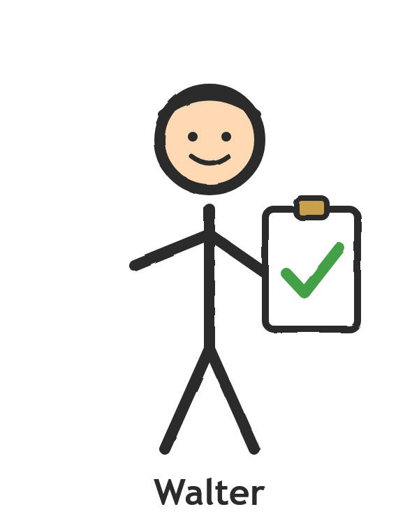

# Systems Engineering für Kinder

> Ein Schul-Workshop, der Volksschulkindern (6–11 Jahre) erklärt, was ein
> **„Systems Engineer"** eigentlich macht — anhand einer Autohupe, die am Ende
> „**IAHHH**" macht.


Entstanden als **Berufsvorstellung** in einer Mehrstufenklasse (1.–4. Klasse) einer
Wiener Volksschule. Das hier war viel Arbeit — und ist **noch lange nicht perfekt
oder allgemein wiederverwendbar**. Aber vielleicht dient es jemandem als Idee,
Vorlage oder Startpunkt. Gerne weiter stricken.

---

## Die Idee

Wie erklärt man 6- bis 11-Jährigen einen abstrakten Beruf, den selbst viele
Erwachsene nicht kennen? Indem man ihn **selber machen lässt**.

Der rote Faden ist eine kleine Geschichte: Kunde **Karl** von der „Einhorn-Flitzer
GmbH" hat beim Autobau auf die Hupe vergessen. Gemeinsam mit der Klasse bauen wir
die Hupe — und stolpern dabei durch genau die Dinge, die Systems Engineering
ausmachen:

1. **Wünsche verstehen** – Was will der Kunde *wirklich*? (Missverständnisse!)
2. **Anforderungen aufschreiben** – „Wenn die Fahrerin drückt, soll das Auto hupen."
3. **In Teile zerlegen** – Taster → Steuergerät → Verstärker → Lautsprecher
4. **Testen & korrigieren** – Hupe zu leise → laut → soll „IAHHH" machen
5. **Im Team zusammenarbeiten** – jede Rolle steuert etwas bei

Am Ende macht die echte Prototyp-Hupe „IAHHH", der Kunde ist begeistert, und jedes
Kind bekommt ein **Diplom** zum Aufhängen.

### Der Kniff: Anforderungen am eigenen Leib

Statt Anforderungen zu *erklären*, lassen wir die Kinder welche **befolgen** und
**schreiben**:

- **Gruppenaufgabe 1:** Die Kinder bekommen 6 Anforderungen und malen danach ein
  Bild. Heraus kommt (meistens) ein Schneemann — oder eben nicht. Aha-Moment:
  „So genau muss man das beschreiben?!"
- **Gruppenaufgabe 2:** Jede Gruppe beschreibt ein Bild (Baum, Haus, Sonne,
  Regenbogen) — **ohne** zu verraten, was es ist — und eine andere Gruppe malt es
  nach. Die Missverständnisse, die dabei entstehen, *sind* die Lektion.

### Die Figuren / Rollen

| | Figur | Rolle | Wofür sie im Vortrag steht |
|---|---|---|---|
|  | **Karl** | Kunde (Einhorn-Flitzer GmbH) | Wünsche & Abnahme |
|  | **Karoline** | Technikerin | baut die Prototypen zum Testen |
|  | **Walter** | Qualitätssicherung | „Wurde es gebaut wie geplant?" |
|  | **Kevin** | Jurist | Gesetze & Vorschriften (Hupe muss *laut* sein!) |

---

## Was steckt im Repo

```
Berufsvorstellung Systems Engineer.md   ← das Vortrags-Skript (Hauptdokument)
Berufsvorstellung Systems Engineer.pdf  ← gerenderte, kindgerechte A4-Fassung
Diplom Konzept.md                       ← Design-Konzept für die Diplom-Urkunde
Diplom.pdf                              ← die fertige Urkunde zum Ausdrucken
Gruppenaufgabe 1.pdf / Gruppenaufgabe 2.pdf  ← Handouts für die Gruppen
Bilder/                                 ← Illustrationen (Figuren, Beispielbilder,
                                          Dekompositions-Diagramme)
Fotos/                                  ← Fotos vom echten Hardware-Prototyp
.claude/skills/md-to-pdf/               ← kleines Tool: Markdown → gestyltes PDF
```

Die **Dekompositions-Diagramme** zeigen, wie die Hupe Schritt für Schritt wächst:

| Variante A | Variante B | Variante C |
|---|---|---|
|  |  |  |
| Taster → Steuergerät → Lautsprecher | + Verstärker (zu leise!) | Computer statt Steuergerät → „IAHHH" möglich |

---

## Ablauf eines Vortrags (Richtwert)

1. **Prolog** – Was ist ein Systems Engineer? (Auto kann viele Dinge, hat ~80 Computer)
2. **Werkzeug** – Was ist eine Anforderung? (Beispiel: das Dreieck)
3. **Gruppenaufgabe 1** – Anforderungen befolgen (Schneemann), ~5 min malen
4. **Gruppenaufgabe 2** – Anforderungen schreiben & tauschen, ~10 + ~5 min
5. **Die Hupe** – Live-Story mit echtem Prototyp: zu leise → laut → „IAHHH"
6. **Fazit & Diplom-Übergabe**

> Tipp: Die `> **Frage:**`-Kästen im Skript sind Stellen zum Innehalten und die
> Klasse mitreden lassen.

---

## Überarbeitungsideen

*Gesammelt aus einem mehrperspektivischen Review des Vortrags (Pädagogik, Fachlichkeit,
Dramaturgie/Timing, Engagement, Sprache). Fazit: inhaltlich stark und fachlich besonders
sauber — die Ideen unten betreffen vor allem die **jüngsten Kinder** und den **Ablauf am
Vortragstag**. Reihenfolge ≈ Hebel/Wirkung.*

### Reihenfolge & Dramaturgie
- **Hupe-Einstieg vor die Gruppenaufgaben ziehen.** Teil 1 (Karl will hupen → erste
  Anforderung → Use-Case-Diagramm → erster leiser Prototyp) gleich nach dem Werkzeug/Dreieck;
  der Höhepunkt (laut → „IAHHH" → Jubel) bleibt **nach** den Gruppenaufgaben. So gehen die
  Kinder mit Sinn-Kontext in die Eigenarbeit, und der ruhige Mittelteil bekommt keinen
  Spannungs-Durchhänger.
- **Walter-/Qualitätssicherungs-Szene kürzen oder streichen.** Das „zu leise wegen
  Schutzpickerl" ist ein *Fertigungsfehler*, kein *Anforderungsfehler* — es vermischt zwei
  Lektionen und verdoppelt die „zu leise"-Schleife. Der saubere Dreischritt
  *leise → laut → Tierlaut* erzählt sich eleganter.

### Rhythmus & Timing
- **Gesamtlänge auf realistisch 45–50 Min straffen** (sonst eher 55–75 Min; die konzentrierte
  Spanne der 6–7-Jährigen liegt bei ~10–15 Min).
- Die beiden ruhigen Gruppenphasen (GA1 + GA2, zusammen ~35 Min Sitzarbeit) **nicht direkt
  hintereinander** — eine kurze Bewegungssekunde dazwischen („alle einmal HUUUP").
- **Sichtbares Zeitmanagement:** Sanduhr/Glocke + „noch 2 Minuten"-Ansagen für die Gruppenphasen.
- **Hupen-Block aktiv rhythmisieren:** bei jedem Prototyp die Geräusche live gemeinsam machen,
  per Daumen/Handzeichen abstimmen, den Taster **reihum** drücken lassen.

### Gruppenaufgabe 2 – auch für die Kleinen
- **Nicht-Schreiber-Variante anbieten:** pro Gruppe eine feste Schreiber-Rolle (3./4. Klasse);
  die Jüngeren als „Form-/Farb-Detektive" einbinden oder die Beschreibung mit vorgedruckten
  Form-/Farbkärtchen **legen** statt schreiben. (Erstklässler können oft noch nicht flüssig
  schreiben — sonst werden sie zu Statisten und die „Stille-Post"-Pointe verpufft.)
- **Vorlage-Bilder nach Schwierigkeit zuteilen:** Haus (4 klare Formen) an die jüngste/schwächste
  Gruppe, Regenbogen (7 Bögen + Wolke) an eine starke 3./4.-Klasse-Gruppe.

### Engagement & Moderation
- **Wortmeldungs-Regel** (zuerst die Kleinen, per Handzeichen) — sonst dominieren die schnellen
  Älteren und die Jüngsten kommen nicht dran.
- Mikro-Abstimmung per Daumen nach jedem Prototyp („Passt das so?").

### Begriffe für die Jüngsten übersetzen
- *Jurist* → „Kevin kennt alle Regeln, die ein Auto einhalten muss"
- *Verstärker* → „macht den Ton lauter, so wie die Lautstärke-Taste"
- *Qualitätssicherung* → „Walter schaut nach, ob alles richtig gebaut wurde"

### Diplom
- Deutschen, für alle lesbaren **Haupttitel** groß nach vorne (z. B. „Nachwuchs-Systems-Engineer:in"
  oder ganz einfach „Hupen-Bau-Diplom"); den englischen Fachbegriff *Model Based Systems
  Engineering* nur klein als Untertitel — so kann auch ein Erstklässler „lesen", wofür er es bekommt.

### Logistik am Vortragstag (Risiken absichern)
- **Gruppen vorab** von der Klassenlehrerin einteilen lassen; die Kinder sitzen schon in
  Gruppentischen, wenn es losgeht (Live-Sortieren kostet sonst 3–5 chaotische Minuten).
- **Audio-Backup:** getestete Sound-Dateien (leise/laut/„IAHHH") auf Handy + Bluetooth-Box als
  Fallback — die Bastelschaltung ist fragil (siehe Anmerkung unten); vor Beginn **alle Töne testen**.
- **GA2-Geheimhaltung:** Bilder in Mappen/umgedreht, Gruppen in getrennte Raumecken, festes
  Weitergabe-Schema an die Tafel (1→2→3→4→1), eine zweite Aufsichtsperson für den Tausch.

---

## Material & Hardware

Die Hupe gibt es als echten Prototyp (siehe `Fotos/`). Es gab eine **leise**
Variante (einfacher Ton-Generator) und eine **laute** Variante (Aktivbox mit
Verstärker). Verwendete Bauteile & Anleitungen:

- **Aktivbox-Bausatz (mit Verstärker):**
  <https://www.conrad.at/de/p/sol-expert-aktivbox-fuer-smartphones-bausatz-1530397.html>
- **Einfacher Ton-Generator (leise Hupe):**
  <https://elektro.turanis.de/html/prj422/index.html>
- **Lenkrad (3D-Druck) + Blende:**
  <https://www.printables.com/make/3448332> +
  <https://www.printables.com/model/1737946-lenkradblende>
- **Tierlaute / „IAHHH":** aus einem Kinder-Soundbuch, z. B.
  <https://www.carlsen.de/pappenbuch/hor-mal-soundbuch-im-zoo/978-3-551-25040-7> —
  oder ein anderes Kinder-Musik-Buch. *Tipp:* Auch wenn die Knöpfe schon kaputt
  sind, ist die eigentliche Elektronik meistens noch funktionstüchtig.

> **Anmerkung:** Schaltungen mit Audiokomponenten sind … herausfordernd. Kurze
> Leitungen, geschirmte Kabel, KISS — und nicht verzweifeln, auch wenn der
> Aktivlautsprecher das Eselgeschrei abspielt, obwohl die Kabel gar nicht
> verbunden sind.

---

## PDFs bauen

Die `.md`-Dateien werden mit einem kleinen, selbst enthaltenen Skript zu
kindgerechten A4-PDFs gerendert (blaue Überschriften, gelbe Frage-Kästen,
eingebettete Bilder). Es braucht **kein** pandoc/wkhtmltopdf/node — nur Python
und ein installiertes Chrome bzw. Edge:

```powershell
python ".claude\skills\md-to-pdf\md_to_pdf.py" "Berufsvorstellung Systems Engineer.md"
```

Das PDF landet neben der Quelldatei. Details & bekannte Stolperfallen stehen in
[.claude/skills/md-to-pdf/SKILL.md](.claude/skills/md-to-pdf/SKILL.md).

---

## Status & Mitmachen

Das ist auf **eine konkrete Klasse, einen konkreten Beruf und einen Nachmittag
Bastelei** zugeschnitten — also bewusst nicht generisch. Was hier fehlt / was man
weiterstricken könnte:

- Vortrags-Skript in andere Sprachen / Altersgruppen übertragen
- Stückliste & Schaltplan für die Hupe sauber dokumentieren
- Druck-Templates für Diplom & Handouts vereinheitlichen
- mehr Gruppenaufgaben-Bilder mit unterschiedlichem Schwierigkeitsgrad

Pull Requests, Issues und „ich hab das in meiner Klasse so gemacht"-Berichte sind
herzlich willkommen.

---

## Lizenz

[MIT](LICENSE) — frei verwenden, anpassen, weitergeben. Wenn du es in einer Klasse
einsetzt, freue ich mich über eine kurze Rückmeldung.
